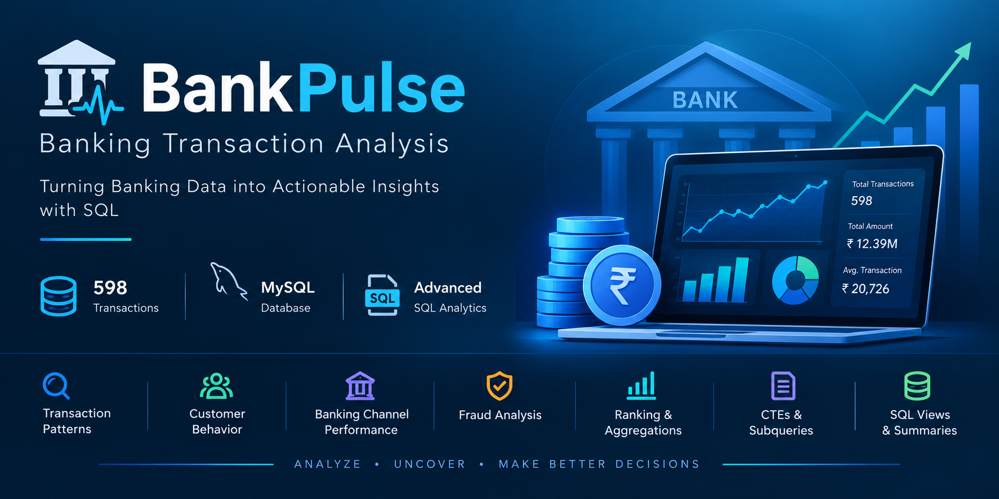

<p align="center">
  
</p>

# 🏦 BankPulse – Banking Transaction Analysis

## 📌 Project Overview

**BankPulse** is a SQL-based data analytics project designed to analyze banking transaction data and uncover meaningful insights into customer behavior, transaction patterns, banking channels, and fraudulent activities.

Using **MySQL**, this project analyzes **598 banking transaction records** and demonstrates practical SQL techniques ranging from basic data retrieval to advanced analytics using **CTEs, subqueries, window functions, ranking, and views**.

The project simulates a real-world banking analytics workflow, where transactional data is transformed into actionable business insights.

---

## 🎯 Project Objectives

The primary objectives of this project are to:

* Analyze banking transaction data using SQL
* Identify transaction patterns and trends
* Detect high-value transactions and customers
* Compare performance across account types and transaction types
* Analyze customer activity across banking channels
* Investigate fraudulent transaction patterns
* Calculate fraud rates across different channels
* Perform customer and state-level ranking
* Create reusable analytical summaries using SQL views
* Demonstrate advanced SQL techniques for real-world data analysis

---

## 📊 Dataset Description

The dataset contains **598 banking transaction records**.

### Main Table

```text
bank_transactions
```

### Key Columns

| Column                  | Description                                      |
| ----------------------- | ------------------------------------------------ |
| `transaction_id`        | Unique identifier for each transaction           |
| `customer_id`           | Unique identifier for each customer              |
| `transaction_date`      | Date of the transaction                          |
| `transaction_time`      | Time of the transaction                          |
| `account_type`          | Type of bank account                             |
| `transaction_type`      | Type of transaction performed                    |
| `transaction_amount`    | Monetary value of the transaction                |
| `transaction_direction` | Credit or debit direction                        |
| `account_balance`       | Customer account balance                         |
| `merchant_category`     | Category of merchant involved                    |
| `state`                 | State where the transaction occurred             |
| `channel`               | Banking channel used for the transaction         |
| `transaction_status`    | Status of the transaction                        |
| `is_fraud`              | Indicates whether the transaction was fraudulent |

---

## 🛠️ Tools & Technologies

* **MySQL**
* **MySQL Workbench**
* **SQL**
* **CSV Dataset**
* **GitHub**

---

# 🔍 Business Questions & Analysis

## 🟢 Beginner Level

Basic SQL queries focused on filtering, sorting, and retrieving transaction data.

1. List all transactions from Maharashtra
2. Find transactions with an amount greater than ₹50,000
3. Identify the top 10 highest-value transactions
4. List all successful transactions
5. Identify all fraudulent transactions

### SQL Concepts Used

* `SELECT`
* `WHERE`
* `ORDER BY`
* `LIMIT`

---

## 🟡 Intermediate Level

Intermediate analysis focused on aggregation, grouping, and customer behavior.

6. Calculate the total transaction value
7. Analyze transactions by account type
8. Find the top 5 customers by total transaction amount
9. Identify states with total transaction amounts above ₹1,000,000
10. Analyze transactions by banking channel
11. Analyze transactions by transaction type
12. Analyze fraudulent transactions by banking channel

### SQL Concepts Used

* `GROUP BY`
* `HAVING`
* `SUM()`
* `COUNT()`
* `AVG()`
* Aggregate analysis

---

## 🔴 Advanced Level

Advanced SQL analysis using subqueries, Common Table Expressions (CTEs), window functions, and views.

13. Find customers whose total transaction amount is above the average customer total
14. Rank customers by total transaction amount
15. Rank states by total transaction amount
16. Rank account types by total transaction amount
17. Analyze monthly transaction trends using a CTE
18. Identify high-frequency customers
19. Calculate the fraud rate for each banking channel
20. Create a monthly transaction summary view

### SQL Concepts Used

* Subqueries
* Common Table Expressions (CTEs)
* Window Functions
* `RANK()`
* `CASE`
* `CREATE VIEW`

---

# 📈 Key Findings

The analysis produced several useful insights:

* 📌 The dataset contains **598 banking transactions**
* 📅 All transactions in the dataset occurred during **January 2019**
* 💰 The total transaction value is approximately **₹12.39 million**
* 📊 The average transaction amount is approximately **₹20,726**
* 🏦 Transaction activity can be compared across multiple banking channels
* 🚨 Fraud analysis helps identify potentially risky transaction channels
* 👥 Customer-level analysis identifies high-value customers
* 🏆 Ranking analysis highlights top-performing customers, states, and account types
* 📈 Monthly summaries provide a structured overview of transaction activity

---

# 🧠 SQL Skills Demonstrated

This project demonstrates practical knowledge of:

* SQL Data Analysis
* Data Filtering
* Data Aggregation
* Customer Analysis
* Transaction Analysis
* Fraud Analysis
* Banking Channel Analysis
* Account Type Analysis
* Subqueries
* Common Table Expressions (CTEs)
* Window Functions
* Ranking with `RANK()`
* Creating SQL Views
* Business-Oriented Data Analysis

---

# 📂 Project Structure

```text
bankpulse/
│
├── README.md
│
├── schema/
│   └── create_tables.sql
│
├── queries/
│   ├── 01_beginner_questions.sql
│   ├── 02_intermediate_questions.sql
│   └── 03_advanced_questions.sql
│
└── screenshots/
    ├── 01_database_table.png
    ├── 02_beginner_q1.png
    ├── 03_intermediate_q7.png
    ├── 04_advanced_q14.png
    └── 05_monthly_view_q20.png
```

---

# 🚀 How to Run the Project

Follow these steps to run the project locally:

### 1. Clone the Repository

```bash
git clone <repository-url>
```

### 2. Open MySQL Workbench

Launch MySQL Workbench and connect to your MySQL server.

### 3. Create the Database

Create or select the database for the project.

```sql
CREATE DATABASE bankpulse;
USE bankpulse;
```

### 4. Create the Table

Run the SQL schema file:

```text
schema/create_tables.sql
```

This will create the `bank_transactions` table.

### 5. Import the Dataset

Import the CSV dataset into the `bank_transactions` table using MySQL Workbench.

### 6. Run the SQL Analysis

Execute the SQL files in the following order:

```text
queries/01_beginner_questions.sql
queries/02_intermediate_questions.sql
queries/03_advanced_questions.sql
```

### 7. Review the Results

Analyze the query outputs directly in MySQL Workbench and review the screenshots included in the project.

---

# 📸 Project Screenshots

The project includes screenshots demonstrating key stages of the analysis:

* Database table structure
* Beginner-level SQL queries
* Intermediate aggregation analysis
* Advanced ranking analysis
* Monthly transaction summary view

> Screenshots are available in the `screenshots/` directory.

---

# 💡 Business Value

BankPulse demonstrates how SQL can be used to transform raw banking transaction data into meaningful business insights.

The analysis can help banking organizations:

* Identify high-value customers
* Monitor transaction activity
* Understand customer behavior
* Compare banking channel performance
* Detect potential fraudulent activity
* Analyze regional transaction trends
* Support data-driven decision-making

---

# 🎓 Key Takeaways

Through this project, I strengthened my practical understanding of:

* Writing efficient SQL queries
* Performing exploratory data analysis using SQL
* Aggregating and summarizing large datasets
* Using CTEs for structured analysis
* Applying window functions for ranking
* Identifying customer and transaction patterns
* Performing fraud-related analysis
* Creating reusable SQL views
* Structuring an end-to-end data analytics project

---

# 🔮 Future Improvements

Potential enhancements for this project include:

* Adding interactive dashboards using **Power BI** or **Tableau**
* Performing deeper fraud detection analysis
* Creating customer segmentation models
* Adding year-over-year and month-over-month comparisons
* Building automated ETL pipelines
* Integrating Python for advanced data analysis
* Creating visualizations for transaction and fraud trends
* Expanding the dataset with additional time periods

---

# 🏁 Conclusion

**BankPulse** demonstrates how SQL can be effectively used to analyze banking transaction data and generate meaningful business insights.

The project covers a complete range of SQL concepts, starting from basic filtering and sorting to advanced techniques such as **subqueries, Common Table Expressions (CTEs), window functions, ranking, fraud rate calculations, and SQL views**.

By analyzing transaction patterns, customer activity, banking channels, and fraudulent transactions, this project provides a practical example of how SQL supports data-driven decision-making in the banking domain.

---


